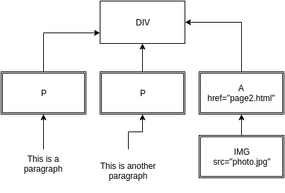
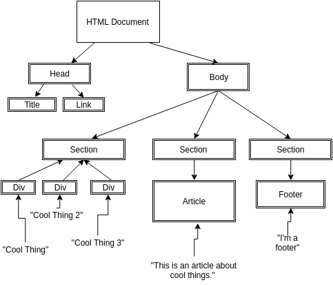

# What happens behind the scenes when you load a web page?


### Welcome to day two!

In the previous lessons, you've learned **a lot** about how to write basic web pages in just a few hours, but what happens behind the scenes? How does your web broswer take that long stream of HTML and turn it into a page?

To know what's going on, you need to take a brief, step-by-step look into the nitty-gritty of how a web page is rendered.

## Step one: The browser loads the HTML as text

By now you're familiar with HTML, and your web browser will load a stream of **tags** that might look something like this.

```
<div>
  <p> This is a paragraph </p>
  <p> This is another paragraph </p>
  <a href="page2.html">
    
  </a>
</div>
```

But this is just a bunch of text, containing "tags." It is not the actual elements on the page when you view them in your web browser, or even a good visual representation of how they will be organized.  
To be able to view the elements, your browser will need to do some further leg work and processing of this HTML


## Step two: Generating the 'DOM'

As stated above, the HTML text you loaded does not directly represent what you're looking at when you view the web page--it's just text with tags. It needs to be "compiled" into an object that computers can read--a sort of data structure like the folders on your computer.

To do this, a program on your web browser will read of each line of HTML and use algorithms to determine where each tag beings and ends and what the children of each element are and use this data to generate a **Document Object Model** or just **DOM**  


When the HTML above is compiled into a DOM, it will generate a **DIV** element that has three children elements: two **P** elements, and one **A** element which has its own **IMG** child element. When we represent this data structure visually with a flowchart, it will look like the upturned 'tree' diagram we see below:



In the diagram above, it is *immediately* clear what the children of each element are, starting from the top. The DIV clearly has three children, and we can see what data belongs to each of them. When we were reading the HTML text, we had to read all the way to the end to find out what elements belonged to what and piece the structure together in out heads. The 'DOM' is the computer data structure that results after this processing has been done.

-------------

# Warm Up Exercise -- Write HTML that would generate the following DOM

In the image below, you are given a sample flowchart representation of the DOM.

In the file `DOM.html`, write the HTML that would, after it had been compiled by the browser, generate the DOM tree below. 


