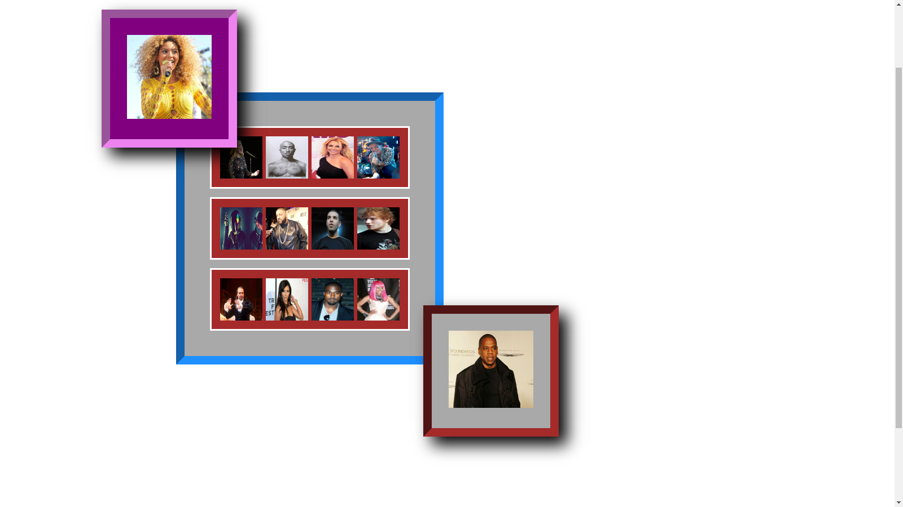

# Day 2 Lesson 2: CSS Layout and Positioning

## Motivation (i.e. What is this, and why should you care? )

In this activity you will learn how to position HTML elements on the screen. This is an *essential* skill to have if you want your websites to look professional and well arranged. Each site you make is like a piece of art, and it's hard to make art if you have no control over where things go!

--------

# Part 1: Hanging Pictures and The 'Box' Model

In this activity, you are going to frame and arrange a collage of different pop stars. With physical photos, you would need to resize your photos, put them in a frame, maybe [add some matting](http://simplyframed.com/blogs/blog/15562616-framing-101-when-to-float-when-to-mat) , and arrange them the way you want on the wall.

When styling HTML elements, you actually follow a very similar process! Follow the steps below to arrange your virtual wall of photos and learn the basics of CSS layout in the process!

## Step 1: Make the Pictures Manageable

First, load the file `family-photos.html` and take a look at the preview. First of all, you'll notice the images are way too large to work with. Let's fix that!.

+ Make all the images with the `star` class have a smaller `width` like 300px and reload the page to see your changes take effect.
+ Make the photos that have both `star` and `small` classes have a width that's at least three times as small as your large photos (like 100px).
+ Make the 'frames' (i.e. DIV elements with the `frame` class) have `display: inline-block`

What happened to your collage when you changed the frames to display inline-block? Block elements can be thought of as rectangles with a height and width and will, by default, appear on a new line, like starting a paragrah.

Inline-block elements are still like blocks and can be resized, but they, like the name implies, they can be 'in-line,' which lets you put multiple elements in a row across the page.

## Step 2: Frame and mat your photos!

At this point, your photos are basically cut straight out of the magazine and glued on the wall--not very elegant. Let's make some frames.

+ Give all elements with the `frame` class an [inset border](http://www.w3schools.com/css/css_border.asp) of about 10 to 30px.

Ahh much better, we have some frames. But there's still something missing. Let's add some space inbetween our frame and its content.

+ Give all the frames a [padding](http://www.w3schools.com/css/css_padding.asp) of at least 10 px.
+ Add a background-color to the the frames so that they stand out from the wall.

## Step 3: Add Some Margins:

Ok, so we've framed our photos with `border`, giving them some breathing room away from the border with `padding` and they look just dandy. But notice that all out frames are still right next to *each other*. There's no breathing room in between frame elements, and all our photos are at the top of the page.

+ Add some `margin` to the frames of at least 20px to space them out from one another.
+ Experiment with specific [left/right/top/bottom margins](http://www.w3schools.com/css/tryit.asp?filename=trycss_margin_sides) to space out your photos *just* the way you want them to be.

## CHALLENGE 1: Overlay photos with absolute Positioning and Z-Index:

